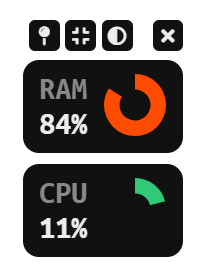

# Activity Monitor

Simple [Electron](http://electron.atom.io) & [React](https://reactjs.org) application that shows RAM and CPU usage.

## Features

- Allows pinning the window to the top
- Black and white mode
- 3 Interface Sizes

## Getting Started

- ``yarn install`` to install dependencies.
- ``yarn electron-dev`` to start the app.

- ``yarn electron-build`` to build the app.

This project was bootstrapped with [Create React App](https://github.com/facebook/create-react-app).